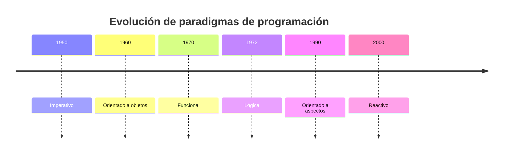

# Introducción a la Programación Orientada a Objetos

La **programación orientada a objetos** (POO) es un paradigma que organiza el software en torno a *objetos*, entidades que combinan estado y comportamiento. Este enfoque facilita la modularidad y el modelado de problemas del mundo real, promoviendo la reutilización y la mantenibilidad del código.

## Historia
- **Década de 1960**: Surge el lenguaje Simula, considerado el primer lenguaje orientado a objetos.
- **Década de 1970**: Smalltalk populariza el término "object-oriented" y establece principios fundamentales como el envío de mensajes entre objetos.
- **Década de 1980 y 1990**: Lenguajes como C++, Java y Python incorporan la POO y la llevan a la industria masiva.
- **Actualidad**: La POO convive con otros paradigmas y sigue siendo uno de los enfoques más utilizados para el desarrollo de software.

## Conceptos principales
- **Clase**: Plantilla que define atributos y métodos comunes a un grupo de objetos.
- **Objeto**: Instancia concreta de una clase que almacena un estado y responde a mensajes.
- **Abstracción**: Proceso de simplificar la realidad destacando lo esencial y ocultando detalles irrelevantes.
- **Encapsulamiento**: Mecanismo que protege el estado interno del objeto, exponiendo solo una interfaz pública.
- **Herencia**: Capacidad de una clase de adquirir propiedades y comportamientos de otra, permitiendo la reutilización de código.
- **Polimorfismo**: Posibilidad de que diferentes objetos respondan de manera distinta al mismo mensaje.
- **Composición**: Técnica para construir clases complejas a partir de otras más simples, favoreciendo el acoplamiento débil.

```mermaid
digraph G {
  node [shape=record];
  Persona [label="{Persona|+nombre\l+hablar()\l}"];
  Estudiante [label="{Estudiante|+matricula\l+estudiar()\l}"];
  Persona -> Estudiante [arrowhead=onormal];
}
```

## La necesidad de otros paradigmas
A pesar de sus ventajas, la POO no resuelve todos los problemas. Situaciones que implican alto grado de concurrencia, control preciso de efectos secundarios o procesamiento de datos masivos pueden beneficiarse de otros paradigmas:

- **Programación funcional**: Énfasis en funciones puras e inmutabilidad, útil para modelar cálculos sin efectos secundarios y facilitar la concurrencia.
- **Programación lógica**: Se basa en hechos y reglas para derivar conclusiones mediante motores de inferencia, adecuada para problemas de búsqueda y razonamiento.
- **Programación orientada a eventos**: Ideal para interfaces gráficas y sistemas que reaccionan a señales externas.
- **Programación reactiva**: Trata datos como flujos y emplea suscripciones para reaccionar a cambios en tiempo real.
- **Programación orientada a aspectos**: Separa las preocupaciones transversales (como el logging o la seguridad) del código principal.

La elección del paradigma depende del problema a resolver. En la práctica moderna se combinan enfoques para aprovechar las fortalezas de cada uno.



## Conclusión
La programación orientada a objetos representa un paso fundamental en la evolución del desarrollo de software. Comprender sus principios permite valorar sus fortalezas y limitaciones, así como reconocer cuándo es conveniente explorar otros paradigmas que complementen nuestras necesidades.
